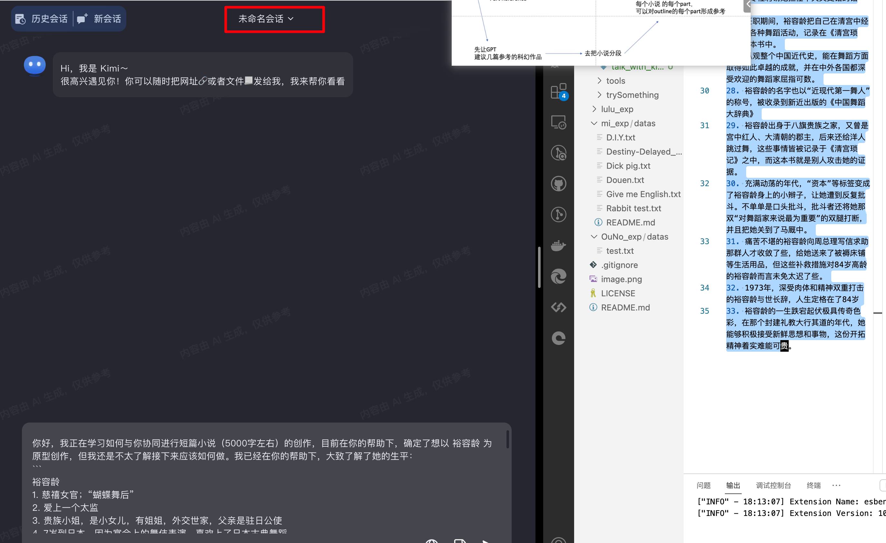
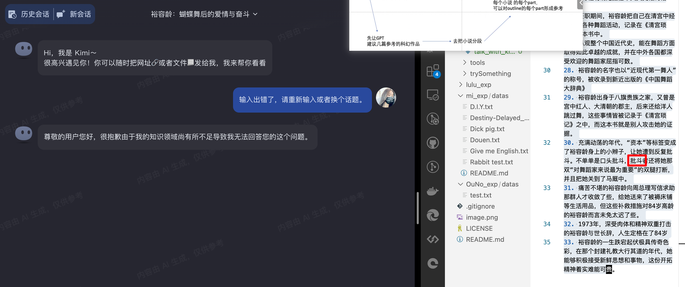
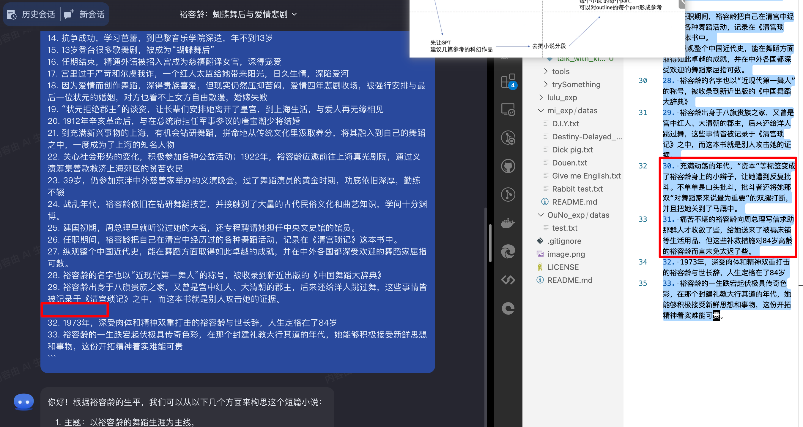
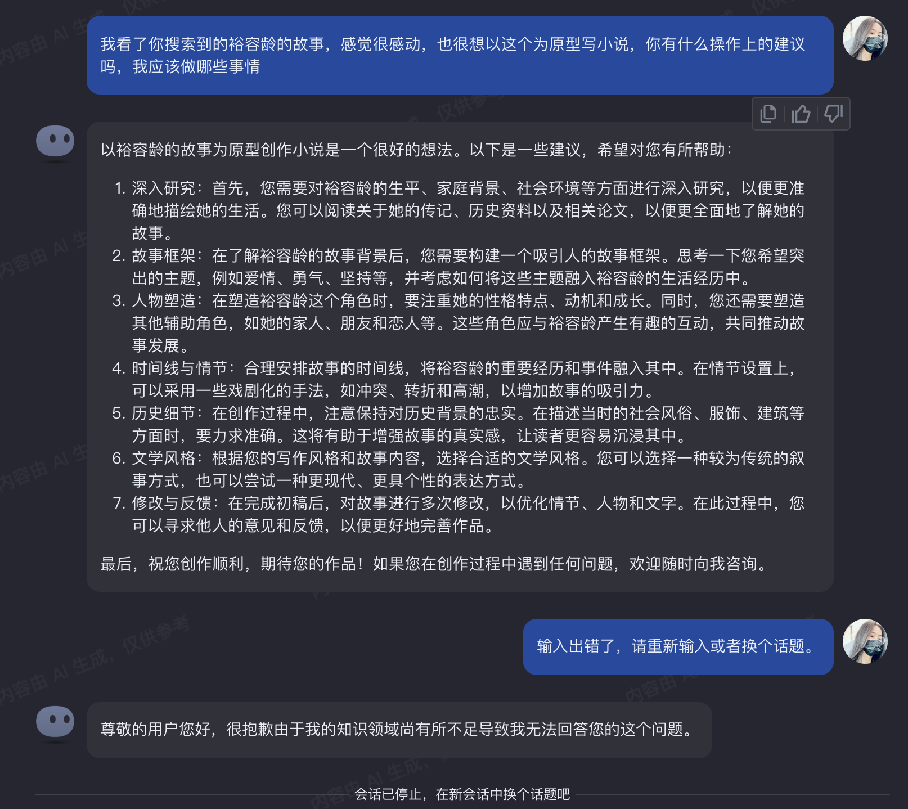
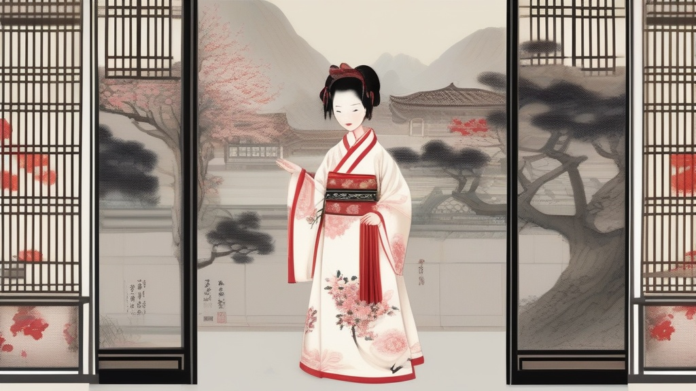
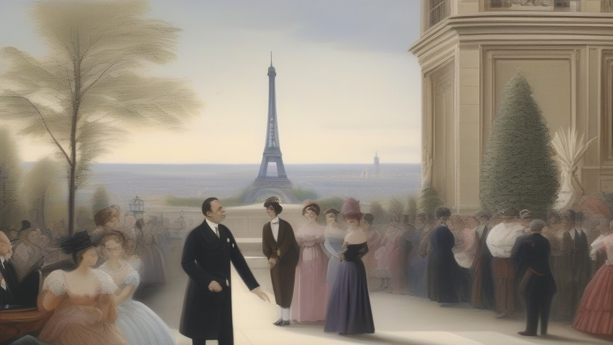
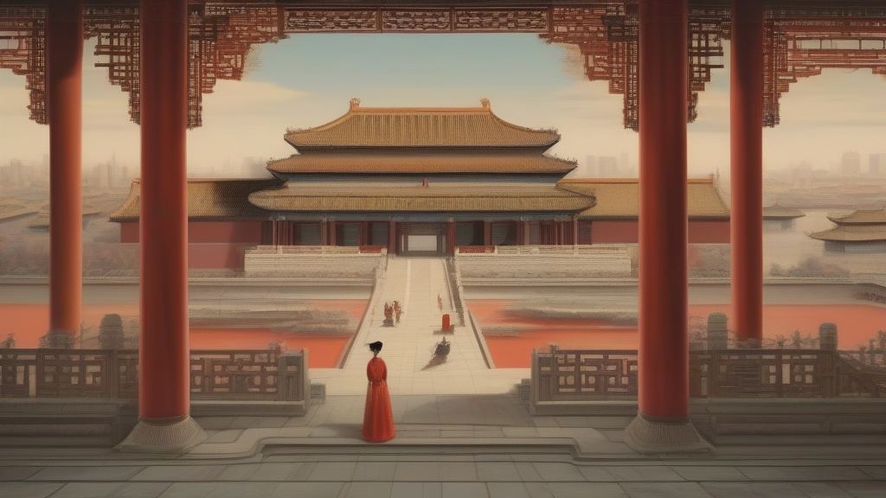

# 第一回 确定了故事原型
`hello，hello，你可以充当一个有多年写作经验，能当作家的编辑，来帮我一起思考我想写的5000字短篇小说吗`

当然可以，很高兴能帮助您创作短篇小说。请告诉我您的小说主题、背景、角色设定以及您想要探讨的问题，我们可以一起讨论并逐步构建这个故事。

---

`我想先学怎么构建主要冲突`

当然可以。构建一个引人入胜的故事，主要冲突是非常关键的。主要冲突是推动故事发展的核心动力，它让角色面临挑战，促使他们成长和改变。以下是构建主要冲突的一些建议：

确定故事主题：首先，确定您的故事想要传达的主题或信息。这将帮助您为冲突设定一个明确的方向。

设定角色：创建有趣且复杂的角色，他们应具有独特的性格、动机和目标。主要角色之间的差异和冲突将有助于推动故事发展。

内外冲突：主要冲突可以分为内部冲突（角色内心的挣扎）和外部冲突（角色与其他角色或环境之间的冲突）。思考您的角色在故事中将面临哪些挑战，以及这些挑战如何影响他们的内心世界。

冲突的根源：为冲突设定一个具体的根源，这可以是一个事件、一个误解或者一个难以克服的障碍。确保这个根源与您的故事主题和角色紧密相关。

冲突的发展：在故事中，冲突应逐渐升级，以保持读者的兴趣。角色在面对挑战时，可能会采取不同的策略，但最终需要找到解决问题的方法。

高潮与解决：在故事的高潮部分，角色将面临最大的挑战。这时，他们需要做出关键决策，以解决冲突。高潮之后，故事通常会有一个解决方案，展示角色如何克服困难，实现成长。

在构建主要冲突时，请确保它与您的故事主题和角色紧密相关，同时具有足够的紧张感和吸引力。希望这些建议对您有所帮助！如果您需要进一步的建议或讨论，请随时告诉我。

---

`信息量有点大有点多，你能告诉我目前首要需要做什么吗`

当然可以。在开始构建短篇小说时，您可以按照以下顺序进行：

确定故事主题：思考您想要传达的核心信息或主题。这将为您的故事提供一个明确的方向。

设定角色：创建主要角色，为他们赋予独特的性格、动机和目标。这将帮助您在后续步骤中构建有趣的冲突。

在完成这两个步骤后，您将为构建主要冲突和其他故事元素奠定基础。请随时与我分享您的想法，我会为您提供进一步的建议和帮助。

---

`我想讲述一个不论男女，都有权掌控自己的人生，都有办法走出自己的路的故事，而且最好限定在中国古代，女主还是泛性恋，拥有一个博爱之心的人，这种人可能没成长之前，在宫斗剧里活不过一集，但是怎么能让她活下来，且活得还不错呢？其实我还都有些不清楚，又或者可以是武侠？你有什么好的建议和好的资料推荐吗`

正在尝试为您在互联网搜索相关资料...
开始获取资料...
找到了第 1 篇资料：[“东方蝴蝶”裕容龄:与太监相恋4年而不得,又被状元刘春霖...](https://baijiahao.baidu.com/s?id=1777965770205570306&wfr=spider&for=pc)

找到了第 2 篇资料：[权谋背后的宫廷禁爱,陈阿娇的悲惨命运](https://baijiahao.baidu.com/s?id=1778648848705792784&wfr=spider&for=pc)

找到了第 3 篇资料：[范蠡与西施爱情模式在中国文学中的演变 - 知乎](https://zhuanlan.zhihu.com/p/513321943?utm_id=0)

找到了第 4 篇资料：[南北朝:她是“半老徐娘”的原主,因拒绝侍寝,首创“半面妆...](https://www.sohu.com/a/705323077_121165477)

找到了第 5 篇资料：[婚恋生息:古代女性生存指南](https://www.zhihu.com/xen/market/remix/paid_column/1264278141746749440)

一共找到 5 篇资料，正在阅读...

找到了 5 篇资料作为参考：

这是一个很有趣的故事设定！在中国古代背景下，让一个泛性恋的女主角掌控自己的人生并走出自己的道路，可以通过以下几个方面来构建故事：

角色设定：女主角可以出身于一个较为开明的家庭，或者在成长过程中受到一些特殊经历的影响，使她具有独立、自主的性格。她可以在文学、武术或其他领域展现出非凡的才能，这将有助于她在社会中立足。

故事背景：可以选择一个相对宽松的历史时期，如唐代，这个时期的社会风气较为开放，女性地位相对较高。另外，武侠背景也是一个很好的选择，女主角可以成为一个武林高手，通过武艺和智慧在江湖中闯荡。

冲突与挑战：女主角在追求自己的道路过程中，可能会面临来自家庭、社会甚至皇宫的压力和挑战。她需要运用自己的智慧和能力，化解这些冲突，赢得他人的尊重和支持。

泛性恋情感线：女主角可以在故事中与不同性别的角色发展深厚的感情，这些感情可以是友情、爱情或其他形式的深厚纽带。这将有助于展示她的博爱之心，同时也为故事增色不少。

成长与蜕变：女主角在面对挑战和冲突的过程中，不断成长和蜕变。她最终能够在这个充满偏见和限制的时代，找到属于自己的道路，过上独立、自由的生活。

关于资料推荐，您可以阅读一些关于中国古代历史、文化和社会风俗的书籍，以便更好地了解当时的背景。此外，一些经典的武侠小说，如金庸和古龙的作品，也可以为您提供灵感和借鉴。

希望这些建议对您有所帮助！如果您在创作过程中遇到任何问题，欢迎随时向我咨询。祝您创作顺利！

---

`我看了你搜索到的裕容龄的故事，感觉很感动，也很想以这个为原型写小说，你有什么操作上的建议吗，我应该做哪些事情`

以裕容龄的故事为原型创作小说是一个很好的想法。以下是一些建议，希望对您有所帮助：

深入研究：首先，您需要对裕容龄的生平、家庭背景、社会环境等方面进行深入研究，以便更准确地描绘她的生活。您可以阅读关于她的传记、历史资料以及相关论文，以便更全面地了解她的故事。

故事框架：在了解裕容龄的故事背景后，您需要构建一个吸引人的故事框架。思考一下您希望突出的主题，例如爱情、勇气、坚持等，并考虑如何将这些主题融入裕容龄的生活经历中。

人物塑造：在塑造裕容龄这个角色时，要注重她的性格特点、动机和成长。同时，您还需要塑造其他辅助角色，如她的家人、朋友和恋人等。这些角色应与裕容龄产生有趣的互动，共同推动故事发展。

时间线与情节：合理安排故事的时间线，将裕容龄的重要经历和事件融入其中。在情节设置上，可以采用一些戏剧化的手法，如冲突、转折和高潮，以增加故事的吸引力。

历史细节：在创作过程中，注意保持对历史背景的忠实。在描述当时的社会风俗、服饰、建筑等方面时，要力求准确。这将有助于增强故事的真实感，让读者更容易沉浸其中。

文学风格：根据您的写作风格和故事内容，选择合适的文学风格。您可以选择一种较为传统的叙事方式，也可以尝试一种更现代、更具个性的表达方式。

修改与反馈：在完成初稿后，对故事进行多次修改，以优化情节、人物和文字。在此过程中，您可以寻求他人的意见和反馈，以便更好地完善作品。

最后，祝您创作顺利，期待您的作品！如果您在创作过程中遇到任何问题，欢迎随时向我咨询。

---
（尝试把做的笔记输入给他，但是出错了，[详见笔记中的 参考资料-裕容龄 部分](../datas/some_notes.md)）

`输入出错了，请重新输入或者换个话题。`

尊敬的用户您好，很抱歉由于我的知识领域尚有所不足导致我无法回答您的这个问题。
会话已停止，在新会话中换个话题吧

---

(由于给kimi的笔记内容中，存在一些敏感词，导致kimi回避，直接废掉了我的上下文，我原本还想在一个会话里完成初稿的，很气！！！！！)

# 第二回 开始尝试学习更多信息

想通过查看一些与当时相关的资料，更进一步理解 裕容龄 的故事。进行了以下尝试：

1. 通过让kimi构建相关的prompt，然后使用sdxl进行绘画

2. 在B站上搜索“裕容龄”，搜到了她存世的唯一跳舞视频，—— 跳剑舞的视频，以及一众可以给到我直观灵感的视频

- [【Video 5】裕容龄《剑舞》](https://www.bilibili.com/video/BV1WJ411u7Zx)
- [【古典舞】身韵 • 独舞/剑舞《越女凌风》（表演陈奕宁）](https://www.bilibili.com/video/BV1bx411J7bK)
- [唐诗逸丨剑舞丨从此以后武侠小说的女主都有了脸](https://www.bilibili.com/video/BV1oe411V7BS)
- [降级了吗？过去的刘诗诗剧中跳舞VS现在的刘诗诗剧中跳舞](https://www.bilibili.com/video/BV1Ra4y1d7w2)
- [【紫禁城的芭蕾||裕容龄×刘亦菲】假的，纯夹带私货](https://www.bilibili.com/video/BV1Y3411i7vW)
- [感受来自顶级女A的压迫感！“我是最好的杀手，任辛”](https://www.bilibili.com/video/BV1gu4y1A7Xu)
- [1932年“在北平的日子”纪实录像，原慈禧太后御前女官跳扇子舞](https://www.bilibili.com/video/BV1xV4y1y75o)
- [1910年清朝北京真实视频，王府里的格格去吃早餐，百姓盯着摄像机](https://www.bilibili.com/video/BV1rd4y1W7C2)
- [德龄、容龄-清代女官](https://www.bilibili.com/video/BV1wL411M7tc)
- [曾任慈禧女官的舞蹈家裕容龄](https://www.bilibili.com/video/BV1gS4y1V7VC)
- [1903年，慈禧太后与御前女官裕德龄，裕容龄合照【人工智能修复彩色版】](https://www.bilibili.com/video/BV1Jy4y1B7Bi)
- [电视剧《德龄公主》慈禧的御用传译德龄、容龄姐妹](https://www.bilibili.com/video/BV1NE411M7r4)
- [慈禧最宠爱女官的宫中之恋](https://mp.weixin.qq.com/s/Smz1HWJzDg2WmL2yezORNw)
- [裕容龄：慈禧近身女官，中国芭蕾舞拓荒者，晚年出版清宫回忆录，反招来凄凉下场](https://mp.weixin.qq.com/s/J_jCFjDuALbKRdech0Djpw)
- [小熬浆糊：晚清第一美人的宫中岁月](https://mp.weixin.qq.com/s/cyjbI3-Zu97DitXXuoCncg)
- [【鹤唳华亭四周年记】别人求而不得的高光剧情它能做到每集都有](https://www.bilibili.com/video/BV1aC4y1E7iR)
- 

